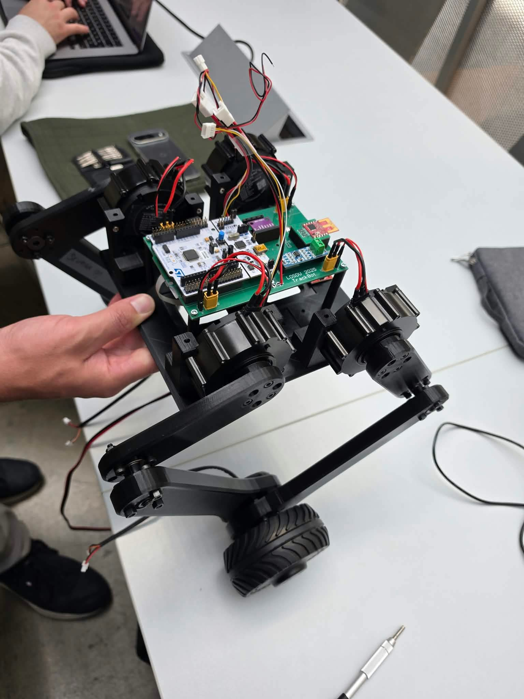
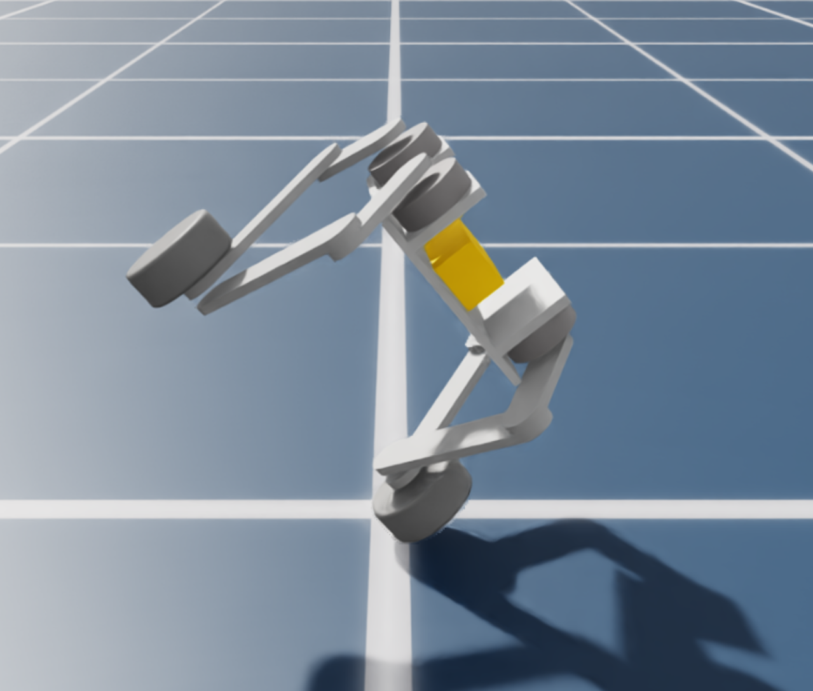
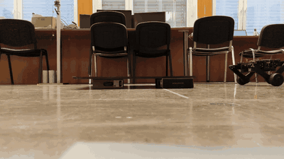
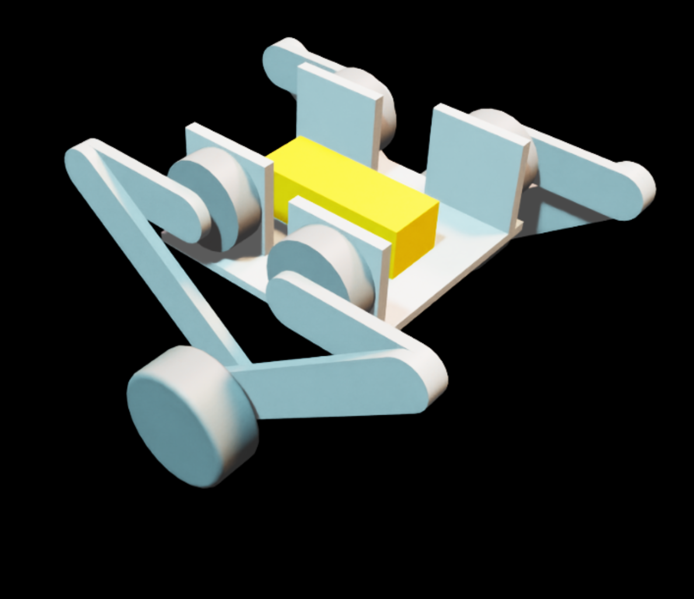
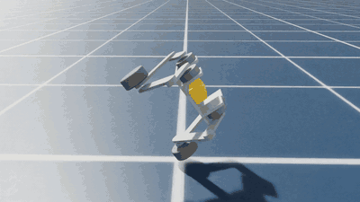

# SDV-Robot: a wheel-legged balancing robot, from STM32 firmware to reinforcement learning

A two-wheeled, wheel-legged robot that balances on an STM32 microcontroller, and a reinforcement
learning (RL) policy small enough to run on that same chip. Course project for *Remote control systems*.

*Reinforcement Learning with a Recurrent Architecture GRU for Complex Movements of a
Two-Wheeled Mobile Robot* — J. Verk, ERK 2026.
[**Paper (PDF)**](https://erk.fe.uni-lj.si/2026/papers/verk%28uporaba_spodbujevanega%29.pdf)

<table>
  <tr>
    <td align="center"><br><sub>The real robot</sub></td>
    <td align="center"><br><sub>Learned policy balancing on one wheel</sub></td>
  </tr>
</table>

## The project in brief

- **Robot.** Four CyberGear leg joints and two DDSM115 hub motors, driven by one STM32F446RE
  with a BNO086 IMU. A handheld transmitter sends commands over a 2.4 GHz radio link.
- **Real deployment.** A hand-tuned state-feedback controller runs on the microcontroller and
  balances the physical robot on two wheels. This is the only controller validated on hardware.
- **Reinforcement learning.** In Isaac Lab, a PPO-trained policy learns to balance the robot on
  **one wheel** at about 47° roll. This is a stance with no closed-form model. The policy is a
  GRU with 32 units followed by a 2×32 MLP, about 6.6 k parameters (26 KB), at a 50 Hz control
  rate.
- **Built for the microcontroller.** Network size, fixed input scaling, control rate and motor
  limits are chosen so the exported policy can run on the STM32.
- **Result in simulation.** The policy survives close to 100 % of episodes for initial roll
  angles within the trained 47° ± 11° band.
- **Not yet done.** The learned policy has not been run on the real robot.

| Folder | Contents |
|---|---|
| [`STM/MAIN`](STM/MAIN) | Robot firmware (STM32CubeIDE project `BipedRobot`) |
| [`STM/TX`](STM/TX) | Handheld transmitter firmware (MRF24J40 radio) |
| [`STM/cmake`](STM/cmake) | CMake/VS Code export of the same firmware and transmitter projects |
| [`Simulation`](Simulation) | Isaac Lab environments, RSL-RL training, export and analysis scripts |
| [`Paper`](Paper) | Written report (ERK 2026): PDF and LaTeX source |
| [`Matlab`](Matlab) | Wireless link exercise (NRZ, CRC-16, Hamming coding) |
| [`Presentation`](Presentation) | Class presentation slides |

```
                    ┌─────────────────────────── Robot ────────────────────────────┐
 remote  ──MRF24J40─┤  STM32F446RE                                                   │
 (STM/TX)   2.4 GHz │   ├─ I²C  ── BNO086 IMU (roll, pitch, gyro, quaternion)        │
                    │   ├─ RS485 ─ 2 × DDSM115 hub motors (current mode, encoders)   │
                    │   ├─ CAN  ── 4 × CyberGear leg joints (position mode)          │
                    │   └─ UART ── debug telemetry / host policy runner              │
                    └────────────────────────────────────────────────────────────────┘
```

The rest of this file gives the details, in the order the project happened: Part 1 is the
firmware and hand-tuned controller, Part 2 is the reinforcement learning.

---

## Deployment on STM32



The real robot jumping.

### Hardware

| Part | Interface | Notes |
|---|---|---|
| STM32F446RE | | Cortex-M4F, 84 MHz system clock |
| BNO086 IMU | I²C, address `0x4B`, INT on `PA1`, RST on `PB15` | SH2 sensor-hub driver in `STM/MAIN/SH2 Sensorhub` |
| 2 × DDSM115 hub motors | RS485 through UART, IDs `0x10` (left) and `0x30` (right) | Current command in, angle/rpm/current out |
| 4 × CyberGear joints | CAN, host ID `0xFE`, motor IDs 17–20 | Position commands, one CAN frame per service call |
| MRF24J40 radio | SPI2 (bit-bang fallback for start-up) | Receives target distance and a leg-extension bit |

### Firmware structure (`STM/MAIN/Core/Src`)

| File | Role |
|---|---|
| `main.c` | Peripheral setup, main loop, control law, safety logic |
| `DDSM115.c`, `DDSMove.c` | RS485 protocol for the hub motors; odometry (distance and speed) from the encoder angle, with unwrap |
| `CyberGear.c`, `CyberMove.c` | CAN protocol for the leg joints, movement helpers |
| `SH2 Sensorhub/` | BNO086 driver (Hillcrest/CEVA SH2) |
| `MRF24J40.c` | 802.15.4 radio driver |
| `Controllers.c`, `kalman.c`, `mpu6050.c` | Earlier LQR and Kalman experiments (MPU6050 predecessor of the BNO) |

The main loop runs `BNO_App` → `RobotData_Update` → `StateData_Update` and then the control law.
The two service functions, `DDSM_Service()` and `CyberGear_Service()`, send one command at a time
so the RS485 and CAN buses are never flooded. Each DDSM115 command waits for the motor's reply
or a timeout.

`state_data` holds the per-wheel state `x = [position, speed, body angle, angular rate]`. The
controller is a full state feedback:

```
u = k1·(x_ref − x) + k2·(v_ref − v) + k3·(φ_ref − φ) + k4·(ω_ref − ω)     → DDSM115 current
```

The gains are hand-tuned and set in `main.c` and `Controllers.c`. The same law runs
independently for the left and right wheel.

Other behaviour in the firmware:

- **Wireless command.** The transmitter sends a distance (at most 1 m) and an up/down bit. The
  distance becomes a ramped position reference at 0.5 m/s. The up bit selects the leg
  extension target (`MRF_UP_TARGET_STEP` or `MRF_DOWN_TARGET_STEP`).
- **Airborne detection.** If wheel speed stays above a safe limit for a set time, the robot is
  declared lifted (250 ms above 1.47 m/s), the drive current is forced to zero, and it re-arms once the legs return to
  their reference positions.
- **Start.** Balancing starts on the blue button, after a 2 s delay. The position references
  are captured at that moment.
- **Telemetry.** A `RD ...` line on the debug UART carries all 20 `robot_data` fields plus the
  four `state_data` values. It can also be logged with STM Studio (`STM/MAIN/STMStudio`).

Detailed notes (Slovenian) are in [`STM/MAIN/ReadMe.md`](STM/MAIN/ReadMe.md), and the change log
against the previous project is in [`STM/MAIN/CHANGE_REPORT.md`](STM/MAIN/CHANGE_REPORT.md).

### Build and flash

1. Open `STM/MAIN` in STM32CubeIDE (*File → Open Projects from File System*) and build the
   `Debug` configuration. The `Debug/` output is not tracked in git.
2. Alternatively, use the CMake export in `STM/cmake/main/BipedRobot` (`cmake --preset Debug`,
   then `cmake --build`).
3. Flash through ST-LINK. Launch configurations for the demo and configurator programs are
   included as `*.launch`.
4. Open the debug UART at 115200 baud (any terminal; STM Studio for plotting).

Regenerating code from `BipedRobot.ioc` in CubeMX rewrites `main.c` outside the
`USER CODE` sections, so keep changes inside those blocks.

---

## Reinforcement Learning



The learning code lives in [`Simulation`](Simulation). The design question is what a policy needs to look like to run on
the microcontroller that already balances the robot.

### The four tasks

| Task ID | Purpose |
|---|---|
| `Template-Twowheeledrobot-Standup-v0` | Self-right from fallen poses |
| `Template-Twowheeledrobot-ResidualLQR-v0` | RL residual on top of an analytical LQR |
| `Template-Twowheeledrobot-PureNNBalance-v0` | Neural-network two-wheel balance, no LQR |
| `Template-Twowheeledrobot-OneLegBalance-v0` | Balance on one wheel at about 47° roll |

Each task extends the previous one, so the sequence goes LQR baseline, RL correcting LQR, RL
replacing LQR, and finally RL doing something no controller in this project does.

### Constraints that come from the MCU

- Hidden layers are capped at `[32, 32]`, which fits the STM32F446RE (512 KB flash, 128 KB SRAM).
- **No learned observation normalizer.** Observations are scaled by fixed constants inside the
  environment, so the firmware can reproduce the exact arithmetic.
- Policy rate is 50 Hz (1 ms physics × decimation 20).
- Wheel actions are motor currents, passed through a DDSM115 model with a deadzone, bias, gain
  asymmetry, first-order current lag, saturation and a torque-speed derate. Sensor noise and
  one-step observation and action delay are randomized.

### The problem

The robot stands on the wheel of one leg (M3) and the other wheel (M6) is lifted and receives no
command. The start pose has the right upper joints (M4, M5) at 0° and the left ones (M1, M2) at
45°. Shifting the upper and lower joints moves the centre of mass over the single contact. Two
quantities must be regulated at once: **roll** φ (about the longitudinal axis, set by the equilibrium at about 47°)
and **pitch** θ (about the transverse axis, forward and back). The wheel torque controls pitch
and the leg joints control roll. There is no actuator about the vertical axis, so the system has
more state variables than independent inputs and is underactuated. The equilibrium roll follows
from the geometry of the robot and is not given to the policy.

### One-leg balance with a recurrent policy



The trained policy in simulation.

The robot lifts its right wheel and balances on the left one at about 47° roll.

The network is

```
obs(6) → GRU(32) → MLP [32, 32] → actions(5)        ≈ 6.6 k parameters ≈ 26 KB as float32
```

The observation is `roll, roll_rate, pitch, pitch_rate, x_rel, velocity` (all measurable on the
robot). The actions are the left wheel current and four leg-joint targets. The GRU hidden state
replaces the stack of previous-action observations, so the exported policy is **stateful**. The
32-float state must be persisted between control steps and zeroed every time the robot enters the
stance.

Training uses PPO (RSL-RL), a spawn-roll curriculum (±5°, ±8°, ±11°), a two-phase reward with a
one-way latch, and a real contact sensor to keep the right wheel off the ground. The settings
are:

- 4000 parallel environments on one GPU, 64 rollout steps per iteration, 1300 iterations. The
  curriculum stages last 350, 350 and 600 iterations.
- Episodes are capped at 10 s (500 steps at 50 Hz). An episode ends as a fall when the pitch
  exceeds 40°, the roll deviates by more than 20°, or the roll exceeds 72°.
- The reward pays for survival and penalises pitch, pitch rate, roll rate, leg-command size and
  rate, wheel current, linear speed, position drift and early termination (−100). Roll itself has
  no target: the squared roll rate is penalised instead, so the network finds the
  equilibrium roll on its own.
- Domain randomization: motor gain 0.8–1.2, deadzone 0.03–0.20 A, current bias ±0.08 A,
  current time constant 0.005–0.020 s, current limit 1.6–2.4 A, IMU roll offset ±0.5°, action
  delay and sensor delay of 0 or 1 step, Gaussian noise of 0.15° on roll and 0.02 rad/s on
  angular rate.
- The wheel current is squashed with `tanh` to ±2 A so the network can never exceed the motor
  limit.

Simulation results from the committed run (`Simulation/pretrained`, 1300 iterations, mean over the
last 50):

| Metric | Value |
|---|---|
| Episode length | 496 / 500 steps |
| Fall rate | 0.000 |
| Mean absolute pitch | 2.8° |
| Position drift | 0.08 m |
| Wheel current RMS | 0.25 A of a 2.0 A limit |

The robustness test starts the robot at initial roll angles from 32° to 60° (6 episodes
per angle, 64 environments). Survival is close to 100 % between about 36° and 57°, which is
the trained 47° ± 11° band. It drops sharply outside it, so the policy does not generalise past
the range it was trained on.

The policy goes from falling in about 1.2 s to surviving full 10 s episodes within roughly 300
iterations. The full learning curve, reward tuning notes and network details are in
[`Simulation/docs/PRESENTATION_BRIEFING.md`](Simulation/docs/PRESENTATION_BRIEFING.md).

### Sim2Real

The sim-to-real argument is that the network is sized for the target hardware from the
start. The 6.6 k parameters take about 26 KB of flash as float32 and under 1 KB of working
memory. One forward pass is estimated at a few tens of microseconds on the Cortex-M4, well inside the 20 ms control step. The control rate is limited by the CAN and RS485 buses, so
simulation runs at the same 50 Hz.

```
train.py ──► model_*.pt ──► play.py ──► policy.pt (TorchScript) + policy.onnx
                                              │
                validate_onnx_policy.py ◄─────┤   parity check, fails above 1e-4
                                              ▼
            uart_policy_runner_one_leg.py ◄─UART JSON lines─► STM32 firmware
```

The host runner reads IMU and wheel telemetry from the STM32, builds the observation, runs the
policy, and sends back wheel current and joint targets. A hand-written C port would use the ONNX
form, which exposes the hidden state as `h_in` and `h_out`. The exact contract is in
[`Simulation/docs/STM32_DEPLOYMENT.md`](Simulation/docs/STM32_DEPLOYMENT.md).

### What has and has not been shown

- **Shown:** the policy converges in simulation, the LQR sign convention and motor model were
  checked with the robot suspended, and the export and parity tooling exists.
- **Not shown:** no hardware run of a learned policy is included. The LQR reference has not been
  tuned and there is no LQR baseline for the one-leg stance. No disturbance was applied during
  one-leg training, and mass and friction randomization ranges exist in the config but are not
  applied.

The hand-tuned state feedback from Part 1 is the only controller validated on the physical robot.

---

## Running the simulation

Requires Isaac Sim / Isaac Lab and a GPU (about 4000–8000 environments fit in 8 GB).

```bash
cd Simulation
python -m pip install -e source/TwoWheeledRobot
python scripts/rsl_rl/train.py --task Template-Twowheeledrobot-OneLegBalance-v0 --headless --num_envs 4096
python scripts/rsl_rl/play.py  --task Template-Twowheeledrobot-OneLegBalance-v0 --num_envs 1 \
       --checkpoint pretrained/one_leg_balance_two_wheel/model_1299.pt
```

Training curves can be drawn from a TensorBoard event file without Isaac Sim
(`scripts/plot_training_curves.py`, needs `tensorboard` and `matplotlib`).

## Robot conventions worth knowing

- CyberGear order everywhere: `[front_left, front_right, back_left, back_right]`, extension sign
  `[+1, −1, −1, +1]`.
- Wheel order `[left, right]`, forward-positive sign `[−1, +1]`.
- `pitch = atan2(g_y, −g_z)`, `roll = atan2(g_x, −g_z)` from body-frame projected gravity.
- Changing an observation layout breaks both checkpoint compatibility and the firmware contract,
  so update `STM32_DEPLOYMENT.md` and the UART runners in the same commit.

## License

See [LICENSE](LICENSE).
